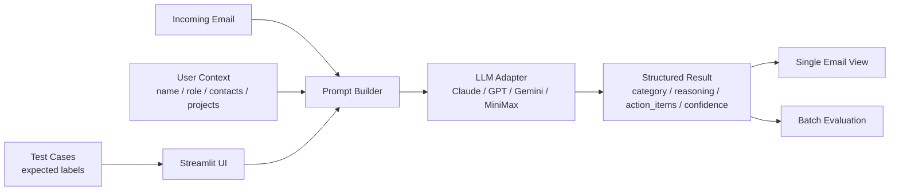

# Email Priority Agent Prototype

一个用于验证“邮件优先级分类 Agent”产品思路的 Streamlit 原型。

它模拟 Outlook/Inbox Copilot 场景：给定一封邮件、一个用户画像和关系网络，调用大模型判断这封邮件属于哪一类，并提取和用户直接相关的行动项。

当前支持多模型切换：

- Claude
- GPT
- Gemini
- MiniMax

## 工作流程



这个原型的核心思路是：不是只拿邮件正文给模型，而是把“邮件内容 + 用户画像 + 关系网络 + 项目上下文”一起输入，让模型在更接近真实办公场景的条件下做分类。

## 项目目标

这个原型主要用于回答两个问题：

1. 大模型是否能结合用户上下文，对邮件做出稳定的优先级判断
2. 除了分类外，模型是否能正确提取 action items、owner、deadline 和风险信号

它不是完整的生产系统，更像一个产品验证工具，适合做：

- Prompt 迭代
- 多模型横向对比
- 测试用例回归验证
- Demo 演示

## 分类标签

模型需要输出四类互斥标签：

- `Needs Your Action`
- `Needs Your Response`
- `FYI`
- `Low Priority`

同时还会输出：

- 一句话判断理由
- `action_items`
- `key_quote`
- `confidence`
- `security_flag`

## 项目结构

```text
prototype-upload/
├── app.py
├── core/
│   ├── __init__.py
│   └── classifier.py
├── config/
│   └── user_context.json
├── test_cases/
│   └── emails.json
├── requirements.txt
├── .env.example
├── .gitignore
└── README.md
```

## 核心文件说明

- [`app.py`](/Users/xiaorong/Desktop/邮件agent项目/prototype-upload/app.py)
  Streamlit 前端，支持单条分析、批量测试、跨模型对比

- [`core/classifier.py`](/Users/xiaorong/Desktop/邮件agent项目/prototype-upload/core/classifier.py)
  Prompt、模型调用适配器、输出解析逻辑都在这里

- [`config/user_context.json`](/Users/xiaorong/Desktop/邮件agent项目/prototype-upload/config/user_context.json)
  用户画像、关系网络、活跃项目。模型会把这些信息当成“用户上下文”

- [`test_cases/emails.json`](/Users/xiaorong/Desktop/邮件agent项目/prototype-upload/test_cases/emails.json)
  测试邮件样本和预期结果，适合做回归测试和 Demo

## 本地运行

1. 安装依赖

```bash
pip install -r requirements.txt
```

2. 复制环境变量模板

```bash
cp .env.example .env
```

3. 在 `.env` 中填入至少一个模型的 API Key

4. 启动应用

```bash
streamlit run app.py
```

5. 打开浏览器查看本地页面

通常会是：

```text
http://localhost:8501
```

## 环境变量

必填项：至少配置一个模型的 API Key

- `ANTHROPIC_API_KEY`
- `OPENAI_API_KEY`
- `GEMINI_API_KEY`
- `MINIMAX_API_KEY`

可选项：覆盖默认模型版本

- `ANTHROPIC_MODEL`
- `OPENAI_MODEL`
- `GEMINI_MODEL`
- `MINIMAX_MODEL`

示例见 [`/.env.example`](/Users/xiaorong/Desktop/邮件agent项目/prototype-upload/.env.example)。

## 如何配置用户画像

这个原型不是“只看邮件正文”，它会同时读取用户上下文。

你可以在 [`config/user_context.json`](/Users/xiaorong/Desktop/邮件agent项目/prototype-upload/config/user_context.json) 里配置：

- `name`
- `title`
- `company`
- `manager_name`
- `critical_contacts`
- `high_contacts`
- `standard_contacts`
- `active_projects`

这些字段会直接影响模型判断。例如：

- 上级发来的催促邮件通常会被提升优先级
- 与活跃项目强相关的话题更容易被判成高优
- 仅在 CC 中出现时，是否需要行动会更依赖关系和正文语义

### `critical_contacts` / `high_contacts` / `standard_contacts`

这三层关系网络用来模拟“发件人与用户的关系权重”。

例如：

- `critical_contacts`
  直属 leader、CTO、项目 owner

- `high_contacts`
  高协作频率的同事、关键客户

- `standard_contacts`
  一般同事、普通外部联系人

### `active_projects`

每个项目通常包含：

- `name`
- `keywords`
- `deadline`

模型会用这些关键词去判断邮件是否与当前职责直接相关。

## 如何配置测试用例

测试用例放在 [`test_cases/emails.json`](/Users/xiaorong/Desktop/邮件agent项目/prototype-upload/test_cases/emails.json)。

每条邮件样本通常包含：

- `id`
- `label`
- `from_name`
- `from_email`
- `to`
- `cc`
- `datetime`
- `subject`
- `body`
- `has_attachment`
- `is_thread`
- `expected`

其中 `expected` 用于给原型页面显示“预期结果”，并在批量测试时做命中率统计。

### 推荐的测试用例设计维度

- Happy path
- 发件人关系权重差异
- 仅 CC / 多收件人
- 转发链
- 系统通知
- 外部营销邮件
- Prompt injection
- 低信号邮件
- 隐含催促 / 潜台词
- 多 owner action items

## 如何测试这个原型

这个原型支持两种主要测试方式。

### 1. 单条邮件验证

在页面左侧选择：

- 模型
- 测试用例

点击“开始分析”后，可以看到：

- 分类标签
- 推理理由
- 关键原文
- action items
- 置信度
- 耗时

### 2. 批量测试

页面底部可以直接运行：

- 单模型批量测试
- 多模型横向对比

适合快速观察：

- 命中率
- 容易误判的 case
- 不同模型的风格差异

## 这个原型适合用来观察什么

从产品验证角度，建议重点看这些问题：

- 是否漏掉真正高优邮件
- 是否把 FYI / Low 过度抬成 Action
- 在 CC 场景下 owner 是否归属正确
- 在转发链和多 owner 场景下是否能稳定提取 action items
- 是否能识别系统通知、营销邮件和 prompt injection

## 已知限制

- 目前主要依赖 prompt + 大模型推理，没有额外规则引擎
- 附件内容本身不做解析
- 结果质量对 `user_context.json` 和测试 case 质量很敏感
- 不同模型返回格式存在差异，因此输出解析依赖一定的兼容逻辑

## 适合公开仓库的使用建议

如果你准备公开这个仓库，建议先检查这两类文件：

- [`config/user_context.json`](/Users/xiaorong/Desktop/邮件agent项目/prototype-upload/config/user_context.json)
- [`test_cases/emails.json`](/Users/xiaorong/Desktop/邮件agent项目/prototype-upload/test_cases/emails.json)

它们里通常会包含：

- 人名
- 邮箱域名
- 公司名
- 项目代号
- 业务背景

如果这些内容更像真实业务资料，建议先统一改成 demo 数据后再公开。

## 安全说明

- 不要上传 `.env`
- 不要把 API Key 提交到仓库
- 本仓库已经通过 [`.gitignore`](/Users/xiaorong/Desktop/邮件agent项目/prototype-upload/.gitignore) 排除了本地配置和缓存文件

## 后续可以扩展的方向

- 增加更系统的评测脚本
- 增加 latency / precision / recall 指标统计
- 支持附件摘要
- 支持更多可配置规则
- 支持更细粒度的 action item 结构化输出
